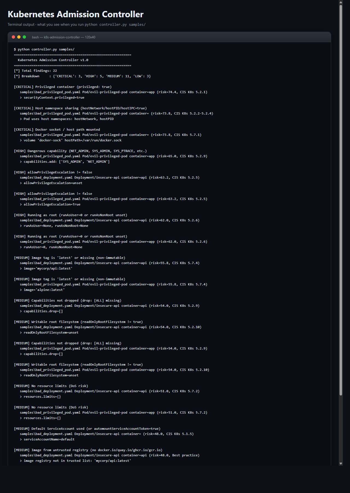
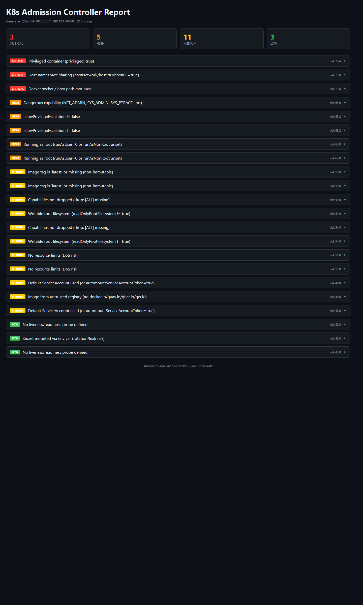

# Kubernetes Admission Controller

> **Policy-as-Code gate for Kubernetes workloads - CIS-mapped, admission-webhook ready, zero mandatory dependencies.**
> A free, self-hosted alternative to OPA Gatekeeper, Kyverno Enterprise, and Styra DAS for teams that want Kubernetes hardening without the enterprise price tag.

[](./LICENSE)
[](https://www.python.org/downloads/)
[](./.github/workflows/k8s.yml)
[](https://www.cisecurity.org/benchmark/kubernetes)

---

## What it does (in one screenshot of terminal output)

```
============================================================
  Kubernetes Admission Controller v1.0
============================================================
[*] Total findings: 22
[*] Breakdown     : {'CRITICAL': 3, 'HIGH': 5, 'MEDIUM': 11, 'LOW': 3}

[CRITICAL] Privileged container (privileged: true)
   samples/bad_privileged_pod.yaml Pod/evil-privileged-pod container=app (risk=74.4, CIS K8s 5.2.1)
   > securityContext.privileged=true

[CRITICAL] Host namespace sharing (hostNetwork/hostPID/hostIPC=true)
   samples/bad_privileged_pod.yaml Pod/evil-privileged-pod (risk=73.8, CIS K8s 5.2.2-5.2.4)
   > Pod uses host namespaces: hostNetwork, hostPID

[CRITICAL] Docker socket / host path mounted
   samples/bad_privileged_pod.yaml Pod/evil-privileged-pod (risk=73.8, CIS K8s 5.7.1)
   > volume 'docker-sock' hostPath=/var/run/docker.sock
```

And opens this interactive dark-mode HTML report with per-finding drill-down: Severity chip &middot; Rule ID &middot; Risk score &middot; Resource kind/name &middot; Container &middot; CIS mapping &middot; Remediation &middot; Suggested fix.

---

## Screenshots (ran locally, zero setup)

**Terminal output** - exactly what you see on the command line:



**Interactive HTML dashboard** - opens in any browser, dark-mode, filterable:



Both screenshots are captured from a real local run against the bundled `samples/` directory. Reproduce them with the quickstart commands below.

---

## Why you want this

| | **K8s Admission Controller** | OPA Gatekeeper | Kyverno | PodSecurity (built-in) |
|---|---|---|---|---|
| **Price** | Free (MIT) | Free (OSS) | Free (OSS) | Free |
| **Runtime deps** | **None** - pure stdlib + bundled yaml_mini | Rego engine | Go binary | None |
| **Install time** | `git clone && python controller.py` | Helm chart | Helm chart | Built into K8s |
| **CLI pre-merge gate** | Yes | Requires conftest | Yes | No |
| **Admission webhook mode** | Yes (`--serve`) | Yes | Yes | Yes |
| **Built-in rules** | 15 CIS-mapped | You write Rego | Kyverno CRDs | 3 levels |
| **Extend with Python** | 10 lines | Rego DSL | YAML CRD | Hardcoded |
| **Works offline / air-gapped** | Yes | Yes | Yes | Yes |
| **Interactive HTML report** | Bundled | No | No | No |

---

## 60-second quickstart

```bash
# 1. Clone
git clone https://github.com/CyberEnthusiastic/k8s-admission-controller.git
cd k8s-admission-controller

# 2. Run it (zero install - pure Python 3.8+ stdlib)
python controller.py samples/

# 3. Open the HTML report
start reports/k8s_report.html      # Windows
open  reports/k8s_report.html      # macOS
xdg-open reports/k8s_report.html   # Linux
```

### Alternative: run as a validating admission webhook

```bash
pip install flask
python controller.py --serve --port 8443
# then point your ValidatingWebhookConfiguration at https://<host>:8443/validate
```

The webhook evaluates every incoming Pod/Deployment/StatefulSet and rejects
admission if any CRITICAL finding exists.

### Alternative: Docker

```bash
docker build -t k8s-admission .
docker run --rm -v "$PWD/manifests:/app/manifests" k8s-admission controller.py manifests/
```

---

## What it detects (15 rule classes)

| ID | Rule | Severity | CIS / Source |
|----|------|----------|--------------|
| K8S-001 | Privileged container (`privileged: true`) | CRITICAL | CIS K8s 5.2.1 |
| K8S-002 | Host namespaces (`hostNetwork`/`hostPID`/`hostIPC=true`) | CRITICAL | CIS K8s 5.2.2-5.2.4 |
| K8S-003 | Running as root (`runAsUser=0` or `runAsNonRoot` unset) | HIGH | CIS K8s 5.2.6 |
| K8S-004 | Dangerous capability (NET_ADMIN / SYS_ADMIN / SYS_PTRACE / SYS_MODULE) | HIGH | CIS K8s 5.2.9 |
| K8S-005 | Capabilities `drop: [ALL]` missing | MEDIUM | CIS K8s 5.2.9 |
| K8S-006 | Writable root filesystem (`readOnlyRootFilesystem != true`) | MEDIUM | CIS K8s 5.2.10 |
| K8S-007 | `allowPrivilegeEscalation` not `false` | HIGH | CIS K8s 5.2.5 |
| K8S-008 | Image tag is `:latest` or missing (non-immutable) | MEDIUM | CIS K8s 5.7.4 |
| K8S-009 | No resource limits (DoS risk) | MEDIUM | CIS K8s 5.7.2 |
| K8S-010 | Default ServiceAccount / `automountServiceAccountToken=true` | MEDIUM | CIS K8s 5.1.5 |
| K8S-011 | Secret mounted via env var | LOW | CIS K8s 5.4.1 |
| K8S-012 | Docker socket / sensitive host path mounted | CRITICAL | CIS K8s 5.7.1 |
| K8S-013 | No liveness/readiness probe | LOW | Best practice |
| K8S-014 | NetworkPolicy missing for namespace | MEDIUM | CIS K8s 5.3.2 |
| K8S-015 | Image from untrusted registry | MEDIUM | Best practice |

Covers Pods, Deployments, StatefulSets, DaemonSets, ReplicaSets, Jobs, and CronJobs out of the box.

---

## Webhook deployment (hand-wavy summary)

1. Build + push: `docker build -t ghcr.io/you/k8s-admission:1.0 . && docker push ghcr.io/you/k8s-admission:1.0`
2. Create TLS secret for the webhook (ValidatingWebhookConfiguration requires HTTPS).
3. Apply this manifest:

```yaml
apiVersion: admissionregistration.k8s.io/v1
kind: ValidatingWebhookConfiguration
metadata:
  name: cyberenthusiastic-admission
webhooks:
  - name: validate.cyber.local
    clientConfig:
      service:
        name: cyber-admission
        namespace: cyber-sec
        path: /validate
      caBundle: <base64-ca>
    rules:
      - apiGroups: [""]
        apiVersions: ["v1"]
        operations: ["CREATE", "UPDATE"]
        resources: ["pods"]
    admissionReviewVersions: ["v1"]
    sideEffects: None
    failurePolicy: Fail
```

---

## Scan your own manifests

```bash
# Scan a single file
python controller.py deploy/production/api.yaml

# Scan a directory (recursive)
python controller.py deploy/

# Custom output paths
python controller.py deploy/ -o out.json --html out.html
```

---

## CI/CD integration (fail PRs on CRITICAL findings)

```yaml
# .github/workflows/k8s-policy.yml
- name: K8s policy check
  run: python controller.py manifests/

- name: Fail on CRITICAL
  run: |
    python -c "
    import json, sys
    r = json.load(open('reports/k8s_report.json'))
    if r['summary']['by_severity']['CRITICAL'] > 0:
        print('CRITICAL K8s policy violations detected')
        sys.exit(1)
    "
```

---

## Extending the rule engine

Add a new rule to `RULES`, then wire it into `check_container()` or `check_pod()`:

```python
{
    "id": "K8S-016",
    "name": "Image not signed with Cosign",
    "severity": "HIGH",
    "confidence": 0.90,
    "cis": "SLSA L3",
    "remediation": "Require cosign verify against your project's public key.",
},
```

---

## Project layout

```
k8s-admission-controller/
|-- controller.py          # main scanner + 15 rules + webhook server
|-- report_generator.py    # dark-mode HTML report
|-- yaml_mini.py           # zero-dep YAML parser (fallback when PyYAML missing)
|-- samples/
|   |-- bad_privileged_pod.yaml
|   |-- bad_deployment.yaml
|   `-- good_hardened_pod.yaml
|-- reports/               # output (gitignored)
|-- Dockerfile
|-- install.sh / install.ps1
|-- requirements.txt       # optional: PyYAML, Flask
|-- README.md
|-- LICENSE / NOTICE / SECURITY.md / CONTRIBUTING.md
```

---

## Roadmap

- [ ] MutatingAdmissionWebhook mode (auto-inject `runAsNonRoot: true`)
- [ ] Cosign / Sigstore image-signature verification
- [ ] NetworkPolicy presence scanner (per-namespace)
- [ ] OpenTelemetry exporter for decisions
- [ ] Helm chart

## License

MIT. See [LICENSE](./LICENSE) and [NOTICE](./NOTICE).

## Security

Responsible disclosure policy: see [SECURITY.md](./SECURITY.md).

## Contributing

PRs welcome! See [CONTRIBUTING.md](./CONTRIBUTING.md).

---

Built by **[Mohith Vasamsetti (CyberEnthusiastic)](https://github.com/CyberEnthusiastic)** as part of the [AI Security Projects](https://github.com/CyberEnthusiastic?tab=repositories) suite.
